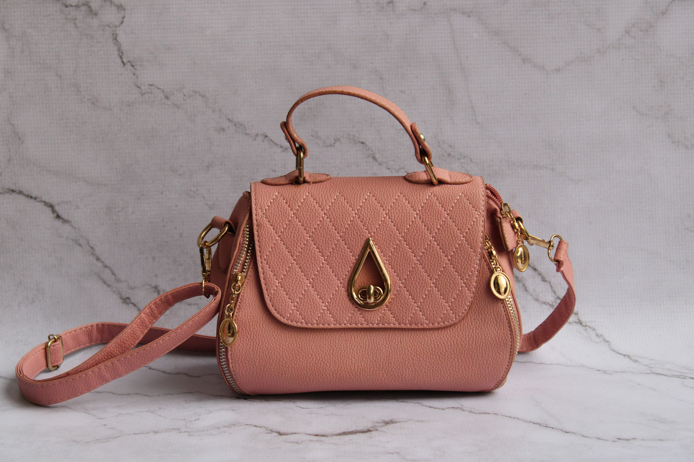
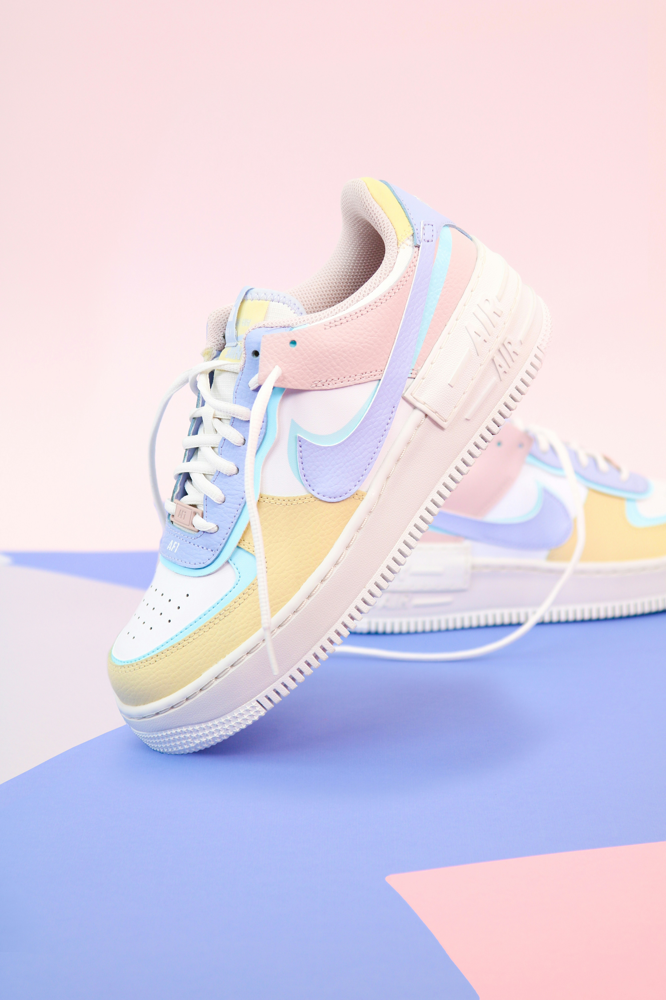
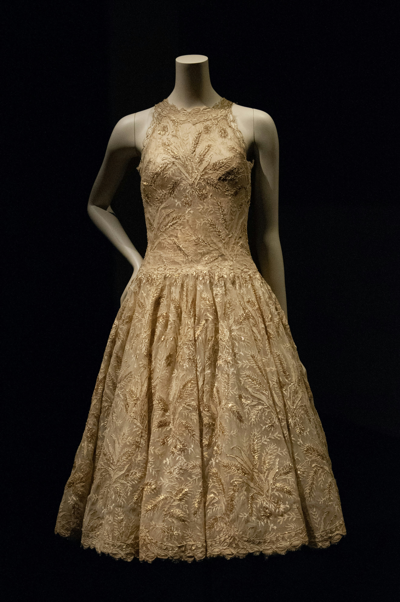
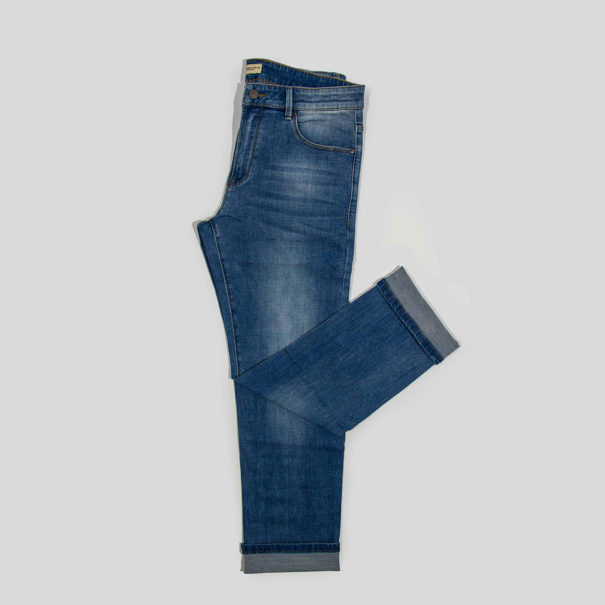

# Elan Fashion

Elan Fashion is a modern fashion platform designed to showcase stylish clothing, shoes and bags for both men and women while providing customers with a smooth and visually appealing browsing experience.

## Overview

The website is designed to create a clean and elegant online shopping experience for fashion lovers interested in trendy and affordable products.

## Visual Identity

* **Images:** High-quality product images for all fashion items.
* **Typography:** Clean and modern arial fonts for readability and style.
* **Theme:** Elegant tone with a luxury fashion aesthetic.


## Key Features

### Semantic HTML5 Structure

The website uses semantic HTML5 tags such as:

- header
- nav
- main
- section
- footer

This improves accessibility, readability, and SEO.

### Interactive Navigation

The navigation menu allows users to quickly access different sections of the website:

- Home
- Products
- About
- Contact

### Product Categories

The platform showcases different fashion categories including:

- Bags
- Shoes
- Dresses
- Jeans

Each category contains product cards with:

- Product Image
- Product Name
- Price
- Star Rating
- Add to Cart Button


## Accessible Media

- All product images include descriptive `alt` text for accessibility and screen readers.

 ### Sample images






### Responsive Product Layout

The website uses Flexbox/Grid layouts to create a responsive product display that adjusts across multiple screen sizes.


### Contact Form Validation

The contact form includes HTML5 validation features such as:

- Required fields
- Email validation

### Social Media Integration

The website  includes social media links for customer engagement and brand visibility.


## Technologies Used

- **Languages:** HTML, CSS
- **Icons:** Font Awesome
- **Layout Techniques:** Flexbox & CSS Grid

## Coding Standards

* Ensure all HTML is semantic and well-structured.
* Maintain a clean and modern fashion-themed UI design.
* Optimize responsiveness across desktop, tablet, and mobile devices.
* Use reusable CSS classes for consistency.

---

## Setup Instructions

### Clone the Repository

```
git clone https://github.com/Idahk19/elan-fashion.git
```
### Open the Project

Open the project folder in VS Code and launch `index.html` using:

- Any browser
- VS Code Live Server extension


## Project Structure

```
elan-fashion/
│
├── about.css
├── about.html
│
├── contact.css
├── contact.html
│
├── index.css
├── index.html
│
├── product.css
├── products.html
│
├── README.md
├── LICENSE
│
└── assets/
    └── images/
        ├── backpack.jpg
        ├── bags.jpg
        ├── dress2.jpg
        ├── dress3.jpg
        ├── dresses.jpg
        ├── jeans.jpg
        ├── jeans2.jpg
        ├── ladieshoes.jpg
        ├── ladiesjeans.jpg
        ├── menshoes.jpg
        ├── sneakers.jpg
        └── totebag.jpg

```
## Future Roadmap

* **Shopping Cart Functionality:** Add dynamic cart updates using JavaScript.
* **Backend Integration:** Build a Django-powered backend for product management.
* **Authentication System:** Allow users to create accounts and log in securely.
* **Payment Integration:** Add M-Pesa and card payment support.
* **Admin Dashboard:** Create a management portal for products and orders.

---

## Git Workflow

- main — production-ready code
- gh-pages — deployed GitHub Pages branch

---

# Contributions are Welcome!

We welcome contributions from the community to improve Elan Fashion and make it a modern and stylish e-commerce platform.

## How to Contribute

1. Fork the Repository — Create your own copy of the project.
2. Create a new branch

```bash
git checkout -b feature/AmazingFeature
```

3. Commit your changes

```bash
git commit -m "Add product cards for shoes and bags"
```

4. Push to your branch

```bash
git push origin feature/AmazingFeature
```

5. Open a Pull Request — Describe your changes and submit for review.

---

## Author

**Idah Karwitha**

Fullstack Developer 

---

## Live Site

```
https://idahk19.github.io/elan-fashion/
```

---

## Copyright

©2026 Elan Fashion. All rights reserved.